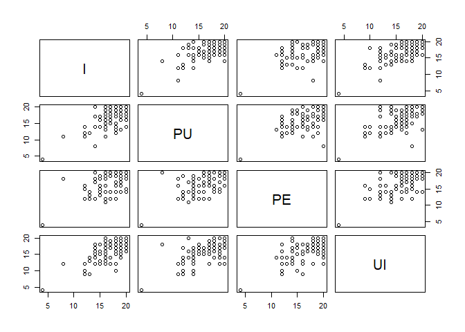

# Analysis Object
Mobile games are video games that have evolved along with technological advances on smartphones as the main device for playing them. This sophistication makes mobile games not only as an entertainment medium, but also presents an element of competition, so that it can be played offline or online as well as multiplayers with various players around the world. The success of mobile games can be seen from the metrics of downloads generated and how often users play mobile games. Therefore, user intention can be a measure to achieve good downloads and usage.

# Variables
To achieve optimal analysis, it is necessary to use other variables such as Interest, Perception of Usability, and Perception of Ease as independent variables that affect the dependent variable, namely User Intentions. The use of these variables is based on the Technology Acceptance Model (TAM) theory by [Davis, Bagozzi, and Warshaw (1989).](https://scholar.google.com/citations?view_op=view_citation&hl=id&user=rKH2D8MAAAAJ&citation_for_view=rKH2D8MAAAAJ:u-x6o8ySG0sC) Therefore, in this analysis the variables used can be proxied as follows:

- Interest (X1) = I
- Perception of Usability (X2) = PU
- Perception of Ease (X3) = PE
- User Intentions (Y) = UI

| Variabel | Indokator | Total_Indikator |
| :------: | :-------: | :-------------: |
| I | I1.1 | 4 |
|   | I1.2 |   |
|   | I1.3 |   |
|   | I1.4 |   |
| PU | PU1.1 | 4 |
|   | PU1.2 |   |
|   | PU1.3 |   |
|   | PU1.4 |   |
| PE | PE1.1 | 4 |
|   | PE1.2 |   |
|   | PE1.3 |   |
|   | PE1.4 |   |
| UI | UI1 | 4 |
|   | UI2 |   |
|   | UI3 |   |
|   | UI4 |   |

# Hypothesis
- **H1** = Effect of Interest on User Intentions
- **H2** = Effect of Perception of Usability on User Intentions
- **H3** = Effect of Perception of Ease on User Intentions
- **H4** = Simultaneous Effect Interest, Perception of Usability, Perception of Ease on User Intentions

# Analysis Methodology
This analysis is quantitative completed with statistics using the Multiple Linear Regression Analysis model. It is used as a method to predict, generate equations, and answer hypotheses. The data sets are primary data types from surveys with a Likert scale.

# Data Input & View
```{r}
# Data input -> indicators
mydata1 <- read.csv("Dataset_UI_1.csv")

nrow(mydata1)
ncol(mydata1)
colnames(mydata1)
```

```{r}
# Data input -> variables
mydata2 <- read.csv("Dataset_UI_2.csv")

nrow(mydata2)
ncol(mydata2)
colnames(mydata2)
```

## 1. Variables Statistical Description
```{r}
# Min, mean, max
summary(mydata2)
```

```{r}
# Standard deviation
d.I <- mydata2$I
sd(d.I)

d.PU <- mydata2$PU
sd(d.PU)

d.PE <- mydata2$PE
sd(d.PE)

d.UI <- mydata2$UI
sd(d.UI)
```

Result is:

- I     -> mean = 17.18, std.dev = 2.70
- PU    -> mean = 16.80, std.dev = 2.97
- PE    -> mean = 17.30, std.dev = 2.98
- UI    -> mean = 16.21, std.dev = 2.98

That is, all data from the variables are homogeneous or there is no significant difference between the data with one another, so it can be assumed to be well distributed.

## 2. Instrument Test: Validity & Reliability
```{r}
# install.packages("dplyr")
# install.packages("psych")

library(dplyr)
library(psych)

valid_I <- select(mydata1, 1,2,3,4)
valid_PU <- select(mydata1, 5,6,7,8)
valid_PE <- select(mydata1, 9,10,11,12)
valid_UI <- select(mydata1, 13,14,15,16)
```

### 2.1 Validity Test
```{r}
alpha(valid_I)

alpha(valid_PU)

alpha(valid_PE)

alpha(valid_UI)
```

Validity score = Item statistics -> raw.r

Significance level of 2-tailed (two-way) degree of freedom = 0.05 (5%) -> df = N-2 = 112-2 = 110, which is 0.186.

Result is:

- I1.1      = 0.82 -> valid
- I1.2      = 0.86 -> valid
- I1.3      = 0.80 -> valid
- I1.4      = 0.81 -> valid
- PU2.1     = 0.86 -> valid
- PU2.2     = 0.81 -> valid
- PU2.3     = 0.88 -> valid
- PU2.4     = 0.85 -> valid
- PE3.1     = 0.77 -> valid
- PE3.2     = 0.86 -> valid
- PE3.3     = 0.91 -> valid
- PE3.4     = 0.88 -> valid
- UI1       = 0.88 -> valid
- UI2       = 0.82 -> valid
- UI3       = 0.85 -> valid
- UI4       = 0.80 -> valid

All indicator items of each variable have a value greater than [(rtable)](https://docs.google.com/file/d/0B61KSjKBWIfsTjBpQVJqMXRtUnM/edit?resourcekey=0-2g4nzqZbpXryGHKY2jVdtA). This means that it can be concluded that all indicator items are **valid**.

### 2.2 Reliability
```{r}
reli <- (select(mydata2, 1,2,3,4))
alpha(reli)
```

Reliability score = Reliability if an item is dropped -> raw_alpha

- I     = 0.83 -> reliable
- PU    = 0.80 -> reliable
- PE    = 0.85 -> reliable
- UI    = 0.81 -> reliable

All variables have a value greater than Cronbach’s Alpha which is worth 0.7 with a degree of freedom 0.05 (5%) [(based on nunnally’s recommendations on the level of reliability in Early stage of research)](https://en.wikipedia.org/wiki/Cronbach%27s_alpha). This means that it can be concluded that all variables are **reliable**.

Conslusion: 

All data are valid and reliable, so it can be used for multiple linear regression analysis.

## 3. Classic Assumption Test
```{r}
# Regression model
# formula lm(Y ~ X1 + X2 + X3)
myreg <- lm(UI ~ I + PU + PE, data = mydata2)
```

### 3.1 Normality Test
```{r}
# Histogram normality
par(mfrow = c(3,2))

hist(mydata2$I, main = "Histogram Interest")
hist(mydata2$PU, main = "Histogram Perception of Usability")
hist(mydata2$PE, main = "Histogram Perception of Ease")
hist(mydata2$UI, main = "Histogram User Intention")
hist(myreg$residuals, main = "Histogram Regression Model")
```


Histogram on the "Regression Model" shows the assumption that it is normally distributed.

```{r}
# Plot normality
par(mfrow = c(2,2))

plot(myreg)
```


The Normal Q-Q graph shows that the plots are close to a linear line, so it can be assumed that the model is normally distributed.

```{r}
# Kolmogorov-Smirnov test
ks.test(myreg$residuals, ecdf(myreg$residuals))
```

Shows that the p-value = 0.904 is greater than the significance of 0.05. The data has been normally distributed.

### 3.2 Multicollinearity Test
```{r}
# install.packages("car")

library(car)
vif(myreg)
```

These results indicate that the VIF score of each variable is not more than 10, so the data is not multicollinearity

### 3.3 Heteroscedasticity Test
```{r}
# Heteroscedasticity Plot (have a same code in Normality plot code)
par(mfrow = c(2,2))

plot(myreg)
```


The Residuals vs Fitted graph shows that the plots no particular pattern. Therefore, there is no symptom of heteroscedasticity.

```{r}
# Heteroscedasticity Plot (other method)
plot(myreg$fitted.values, myreg$residuals,
     xlab = "Fiited Values", ylab = "Residuals", col.axis = "red")
```


The result it's same. The plots no particular pattern. Therefore, there is no symptom of heteroscedasticity.

```{r}
# Heteroscedasticity -> using Glejser test
# install.packages("skedastic")

library(skedastic)
glejser(myreg)
```

The score of p-value 0.607 > absolute residuals significance 0.05. Therefore, there is no symptom of heteroscedasticity.

## 4. Correlation Coefficient (R) Test
```{r}
# Using Pearson Correlation
cor(mydata2$I, mydata2$UI, method = "pearson")

cor(mydata2$PU, mydata2$UI, method = "pearson")

cor(mydata2$PE, mydata2$UI, method = "pearson")
```

The significance value of each variable is < 0.05, so the independent variable (X) is independently correlated with the dependent variable (Y).

- I -> UI   = 0.683 -> strong correlation
- PU -> UI  = 0.656 -> strong correlation
- PE -> UI  = 0.574 -> moderate correlation

```{r}
# Using Pearson Correlation in "cor.test" this is the example
# I'm using variable "I" and "UI"
cor.test(mydata2$I, mydata2$UI, method = "pearson")
```

The result it's same, but in "cor.test" we have more information.

corr value is 0.683 (same with previous)

```{r}
# We can also see it in multiple scatterplots
pairs(mydata2[, c(1,2,3,4)])
```



```{r}
# Correlation Visualization
# install.packages("ggpubr") -> library for customize "ggplot2"
library("ggpubr")
```

We can see the result of scatterplots for all variables with the correlation (r/R) version.

```{r}
# We can also making scatterplots for each variable (x,y). This is the example
# I'm using variable "I" and "UI"
ggscatter(mydata2, x = "I", y = "UI",
          add = "reg.line", conf.int = TRUE,
          cor.coef = TRUE, cor.method = "pearson",
          xlab = "Mobile Games Interest", ylab = "Mobile Games User Intentions")
```


We can see and customize the result of correlation scatterplots for each variable.

## 5. Autocorrelation Test
```{r}
# Autocorrelation test is especially for data panel or time series data. But, this the code for example
# install.packages("lmtest")
library(lmtest)
dwtest(myreg)
```

The Durbin-Watson test p-value is more than 0.05, so it can be said that there is no influence between the previous and latest data, it can be said that the assumption of no autocorrelation between the regression model data is met.

## 6. Multiple Linear Regression Test
```{r}
# Regression Model
myreg <- lm(UI ~ I + PU + PE, data = mydata2)

# The result is including R-square, Hypothesis test (F-statistics/F-test/Fit model & t-test)
summary(myreg)
```

**Adjusted R-squared: 0.565**

The independent variable (X) contributes to the dependent variable (Y) by 56%, the remaining 44% is the influence of other variables not tested in this analysis.

**F-statistic: 49.14, p-value: < 2.2e-16 -> p-value: < 0.000**

That is, the significance value on the ANOVA is 0.000 so that the independent variable (X) has a simultaneous effect on the variable (Y). In other words, the regression model is fit and feasible.

**Hypothesis test/t-test:**

- I   = 9.06e-07 = 0.000 < 0.05
- PU  = 0.00548 < 0.05
- PE  = 0.01532 < 0.05

These results indicate that each independent variable (X) has a significant effect on the dependent variable (Y). The direction of significance shows a positive effect because the "Estimate" and "t value" for all variables (X) are positive.

## 7. Multiple Linear Regression Equation

Estimate:    

- (Intercept)  0.28258  
- I            0.46492
- PU           0.26340
- PE           0.20285

The equation of multiple linear regression: Y = a + b1X1 + b2X2 + b3X3 + ... + bnXn + e,

The equation model this analysis have: **Y = 0.283 + 0.465X1 + 0.263X2 + 0.203X3**

The constant value is 0.283, meaning that if there is no influence from the independent variable, the value of the Y variable is 0.283. The value of the X1 coefficient of 0.465 is positive, so if the X1 variable is increased, the Y variable also increases. The X2 coefficient value of 0.263 is positive, so if the X2 variable is increased, the Y variable also increases. The X3 coefficient value of 0.203 is positive, so if the X3 variable is increased, the Y variable also increases.

## 8. Version R 
```{r}
# R/Rstudio version I use
sessionInfo()
```