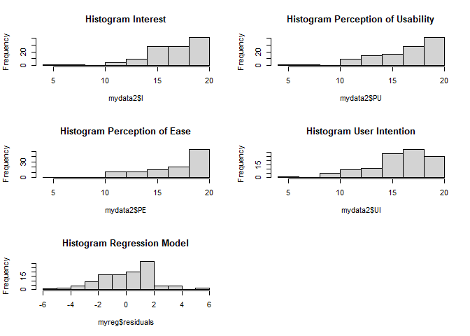
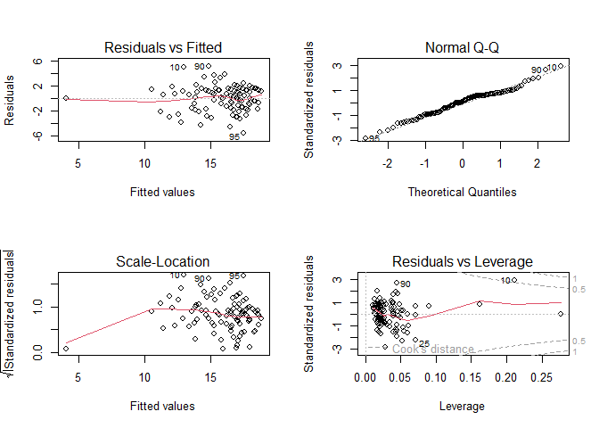

Analysis of Mobile Games User Intentions in Indonesia (Multiple Linear
Regression)
================

# Analysis Object

Mobile games are video games that have evolved along with technological
advances on smartphones as the main device for playing them. This
sophistication makes mobile games not only as an entertainment medium,
but also presents an element of competition, so that it can be played
offline or online as well as multiplayers with various players around
the world. The success of mobile games can be seen from the metrics of
downloads generated and how often users play mobile games. Therefore,
user intention can be a measure to achieve good downloads and usage.

# Variables

To achieve optimal analysis, it is necessary to use other variables such
as Interest, Perception of Usability, and Perception of Ease as
independent variables that affect the dependent variable, namely User
Intentions. The use of these variables is based on the Technology
Acceptance Model (TAM) theory by [Davis, Bagozzi, and Warshaw
(1989).](https://scholar.google.com/citations?view_op=view_citation&hl=id&user=rKH2D8MAAAAJ&citation_for_view=rKH2D8MAAAAJ:u-x6o8ySG0sC)
Therefore, in this analysis the variables used can be proxied as
follows:

-   Interest (X1) = I
-   Perception of Usability (X2) = PU
-   Perception of Ease (X3) = PE
-   User Intentions (Y) = UI

| Variabel | Indokator | Total_Indikator |
|:--------:|:---------:|:---------------:|
|    I     |   I1.1    |        4        |
|          |   I1.2    |                 |
|          |   I1.3    |                 |
|          |   I1.4    |                 |
|    PU    |   PU1.1   |        4        |
|          |   PU1.2   |                 |
|          |   PU1.3   |                 |
|          |   PU1.4   |                 |
|    PE    |   PE1.1   |        4        |
|          |   PE1.2   |                 |
|          |   PE1.3   |                 |
|          |   PE1.4   |                 |
|    UI    |    UI1    |        4        |
|          |    UI2    |                 |
|          |    UI3    |                 |
|          |    UI4    |                 |

# Hypothesis

-   **H1** = Effect of Interest on User Intentions
-   **H2** = Effect of Perception of Usability on User Intentions
-   **H3** = Effect of Perception of Ease on User Intentions
-   **H4** = Simultaneous Effect Interest, Perception of Usability,
    Perception of Ease on User Intentions

# Analysis Methodology

This analysis is quantitative completed with statistics using the
Multiple Linear Regression Analysis model. It is used as a method to
predict, generate equations, and answer hypotheses. The data sets are
primary data types from surveys with a Likert scale.

# Data Input & View

``` r
# Data input -> indicators
mydata1 <- read.csv("Dataset_UI_1.csv")

nrow(mydata1)
```

    ## [1] 112

``` r
ncol(mydata1)
```

    ## [1] 16

``` r
colnames(mydata1)
```

    ##  [1] "I1.1"  "I1.2"  "I1.3"  "I1.4"  "PU2.1" "PU2.2" "PU2.3" "PU2.4" "PE3.1"
    ## [10] "PE3.2" "PE3.3" "PE3.4" "UI1"   "UI2"   "UI3"   "UI4"

``` r
# Data input -> variables
mydata2 <- read.csv("Dataset_UI_2.csv")

nrow(mydata2)
```

    ## [1] 112

``` r
ncol(mydata2)
```

    ## [1] 4

``` r
colnames(mydata2)
```

    ## [1] "I"  "PU" "PE" "UI"

## 1. Variables Statistical Description

``` r
# Min, mean, max
summary(mydata2)
```

    ##        I               PU             PE             UI       
    ##  Min.   : 4.00   Min.   : 4.0   Min.   : 4.0   Min.   : 4.00  
    ##  1st Qu.:16.00   1st Qu.:15.0   1st Qu.:16.0   1st Qu.:15.00  
    ##  Median :18.00   Median :17.0   Median :18.0   Median :17.00  
    ##  Mean   :17.18   Mean   :16.8   Mean   :17.3   Mean   :16.21  
    ##  3rd Qu.:19.00   3rd Qu.:19.0   3rd Qu.:20.0   3rd Qu.:18.00  
    ##  Max.   :20.00   Max.   :20.0   Max.   :20.0   Max.   :20.00

``` r
# Standard deviation
d.I <- mydata2$I
sd(d.I)
```

    ## [1] 2.702066

``` r
d.PU <- mydata2$PU
sd(d.PU)
```

    ## [1] 2.970847

``` r
d.PE <- mydata2$PE
sd(d.PE)
```

    ## [1] 2.985971

``` r
d.UI <- mydata2$UI
sd(d.UI)
```

    ## [1] 2.980835

Result is:

-   I -\> mean = 17.18, std.dev = 2.70
-   PU -\> mean = 16.80, std.dev = 2.97
-   PE -\> mean = 17.30, std.dev = 2.98
-   UI -\> mean = 16.21, std.dev = 2.98

That is, all data from the variables are homogeneous or there is no
significant difference between the data with one another, so it can be
assumed to be well distributed.

## 2. Instrument Test: Validity & Reliability

``` r
# install.packages("dplyr")
# install.packages("psych")

library(dplyr)
```

    ## 
    ## Attaching package: 'dplyr'

    ## The following objects are masked from 'package:stats':
    ## 
    ##     filter, lag

    ## The following objects are masked from 'package:base':
    ## 
    ##     intersect, setdiff, setequal, union

``` r
library(psych)

valid_I <- select(mydata1, 1,2,3,4)
valid_PU <- select(mydata1, 5,6,7,8)
valid_PE <- select(mydata1, 9,10,11,12)
valid_UI <- select(mydata1, 13,14,15,16)
```

### 2.1 Validity Test

``` r
alpha(valid_I)
```

    ## 
    ## Reliability analysis   
    ## Call: alpha(x = valid_I)
    ## 
    ##   raw_alpha std.alpha G6(smc) average_r S/N   ase mean   sd median_r
    ##       0.84      0.84    0.83      0.57 5.3 0.025  4.3 0.68     0.56
    ## 
    ##     95% confidence boundaries 
    ##          lower alpha upper
    ## Feldt     0.78  0.84  0.88
    ## Duhachek  0.79  0.84  0.89
    ## 
    ##  Reliability if an item is dropped:
    ##      raw_alpha std.alpha G6(smc) average_r S/N alpha se  var.r med.r
    ## I1.1      0.80      0.81    0.76      0.58 4.2    0.034 0.0221  0.52
    ## I1.2      0.76      0.76    0.68      0.51 3.2    0.038 0.0055  0.48
    ## I1.3      0.80      0.80    0.73      0.57 4.0    0.033 0.0019  0.59
    ## I1.4      0.82      0.82    0.78      0.60 4.6    0.031 0.0212  0.59
    ## 
    ##  Item statistics 
    ##        n raw.r std.r r.cor r.drop mean   sd
    ## I1.1 112  0.82  0.81  0.71   0.66  4.2 0.85
    ## I1.2 112  0.86  0.87  0.84   0.75  4.4 0.81
    ## I1.3 112  0.80  0.82  0.76   0.66  4.6 0.73
    ## I1.4 112  0.81  0.79  0.67   0.62  4.0 0.90
    ## 
    ## Non missing response frequency for each item
    ##         1    2    3    4    5 miss
    ## I1.1 0.01 0.01 0.21 0.36 0.42    0
    ## I1.2 0.01 0.01 0.12 0.29 0.57    0
    ## I1.3 0.01 0.01 0.06 0.22 0.70    0
    ## I1.4 0.01 0.02 0.29 0.32 0.37    0

``` r
alpha(valid_PU)
```

    ## 
    ## Reliability analysis   
    ## Call: alpha(x = valid_PU)
    ## 
    ##   raw_alpha std.alpha G6(smc) average_r S/N   ase mean   sd median_r
    ##       0.87      0.87    0.84      0.63 6.9 0.019  4.2 0.74     0.65
    ## 
    ##     95% confidence boundaries 
    ##          lower alpha upper
    ## Feldt     0.83  0.87  0.91
    ## Duhachek  0.83  0.87  0.91
    ## 
    ##  Reliability if an item is dropped:
    ##       raw_alpha std.alpha G6(smc) average_r S/N alpha se   var.r med.r
    ## PU2.1      0.83      0.83    0.77      0.62 4.8    0.028 0.00416  0.64
    ## PU2.2      0.86      0.86    0.80      0.67 6.0    0.023 0.00013  0.67
    ## PU2.3      0.82      0.82    0.76      0.60 4.5    0.030 0.00304  0.60
    ## PU2.4      0.84      0.84    0.78      0.64 5.3    0.026 0.00132  0.64
    ## 
    ##  Item statistics 
    ##         n raw.r std.r r.cor r.drop mean   sd
    ## PU2.1 112  0.86  0.86  0.80   0.75  4.3 0.86
    ## PU2.2 112  0.81  0.82  0.72   0.68  4.4 0.80
    ## PU2.3 112  0.88  0.88  0.83   0.77  4.2 0.93
    ## PU2.4 112  0.85  0.84  0.77   0.72  3.9 0.90
    ## 
    ## Non missing response frequency for each item
    ##          1    2    3    4    5 miss
    ## PU2.1 0.01 0.02 0.16 0.31 0.50    0
    ## PU2.2 0.01 0.00 0.14 0.29 0.55    0
    ## PU2.3 0.03 0.01 0.15 0.34 0.47    0
    ## PU2.4 0.03 0.03 0.21 0.48 0.26    0

``` r
alpha(valid_PE)
```

    ## 
    ## Reliability analysis   
    ## Call: alpha(x = valid_PE)
    ## 
    ##   raw_alpha std.alpha G6(smc) average_r S/N   ase mean   sd median_r
    ##       0.88      0.88    0.86      0.64 7.2 0.018  4.3 0.75     0.67
    ## 
    ##     95% confidence boundaries 
    ##          lower alpha upper
    ## Feldt     0.84  0.88  0.91
    ## Duhachek  0.84  0.88  0.91
    ## 
    ##  Reliability if an item is dropped:
    ##       raw_alpha std.alpha G6(smc) average_r S/N alpha se  var.r med.r
    ## PE3.1      0.88      0.88    0.84      0.72 7.6    0.019 0.0019  0.69
    ## PE3.2      0.85      0.85    0.81      0.65 5.6    0.025 0.0149  0.66
    ## PE3.3      0.81      0.81    0.75      0.58 4.2    0.030 0.0093  0.53
    ## PE3.4      0.83      0.83    0.78      0.63 5.0    0.027 0.0073  0.66
    ## 
    ##  Item statistics 
    ##         n raw.r std.r r.cor r.drop mean   sd
    ## PE3.1 112  0.77  0.79  0.68   0.63  4.4 0.75
    ## PE3.2 112  0.86  0.85  0.78   0.73  4.2 0.94
    ## PE3.3 112  0.91  0.91  0.89   0.83  4.4 0.84
    ## PE3.4 112  0.88  0.87  0.83   0.77  4.3 0.95
    ## 
    ## Non missing response frequency for each item
    ##          1    2    3    4    5 miss
    ## PE3.1 0.01 0.00 0.10 0.32 0.57    0
    ## PE3.2 0.01 0.04 0.20 0.25 0.51    0
    ## PE3.3 0.01 0.01 0.15 0.25 0.58    0
    ## PE3.4 0.02 0.04 0.13 0.29 0.52    0

``` r
alpha(valid_UI)
```

    ## 
    ## Reliability analysis   
    ## Call: alpha(x = valid_UI)
    ## 
    ##   raw_alpha std.alpha G6(smc) average_r S/N   ase mean   sd median_r
    ##       0.85      0.86    0.83       0.6 6.1 0.023  4.1 0.75      0.6
    ## 
    ##     95% confidence boundaries 
    ##          lower alpha upper
    ## Feldt     0.80  0.85  0.89
    ## Duhachek  0.81  0.85  0.90
    ## 
    ##  Reliability if an item is dropped:
    ##     raw_alpha std.alpha G6(smc) average_r S/N alpha se   var.r med.r
    ## UI1      0.78      0.79    0.71      0.55 3.7    0.035 0.00017  0.55
    ## UI2      0.82      0.83    0.77      0.62 4.8    0.029 0.00244  0.63
    ## UI3      0.83      0.83    0.77      0.62 4.8    0.028 0.00572  0.63
    ## UI4      0.83      0.84    0.78      0.63 5.2    0.028 0.00486  0.66
    ## 
    ##  Item statistics 
    ##       n raw.r std.r r.cor r.drop mean   sd
    ## UI1 112  0.88  0.89  0.85   0.79  4.1 0.80
    ## UI2 112  0.82  0.83  0.75   0.68  3.9 0.87
    ## UI3 112  0.85  0.83  0.74   0.68  3.9 1.07
    ## UI4 112  0.80  0.81  0.71   0.66  4.3 0.81
    ## 
    ## Non missing response frequency for each item
    ##        1    2    3    4    5 miss
    ## UI1 0.01 0.03 0.14 0.50 0.32    0
    ## UI2 0.01 0.04 0.26 0.44 0.25    0
    ## UI3 0.04 0.08 0.14 0.39 0.35    0
    ## UI4 0.01 0.02 0.12 0.38 0.47    0

Validity score = Item statistics -\> raw.r

Significance level of 2-tailed (two-way) degree of freedom = 0.05 (5%)
-\> df = N-2 = 112-2 = 110, which is 0.186.

Result is:

-   I1.1 = 0.82 -\> valid
-   I1.2 = 0.86 -\> valid
-   I1.3 = 0.80 -\> valid
-   I1.4 = 0.81 -\> valid
-   PU2.1 = 0.86 -\> valid
-   PU2.2 = 0.81 -\> valid
-   PU2.3 = 0.88 -\> valid
-   PU2.4 = 0.85 -\> valid
-   PE3.1 = 0.77 -\> valid
-   PE3.2 = 0.86 -\> valid
-   PE3.3 = 0.91 -\> valid
-   PE3.4 = 0.88 -\> valid
-   UI1 = 0.88 -\> valid
-   UI2 = 0.82 -\> valid
-   UI3 = 0.85 -\> valid
-   UI4 = 0.80 -\> valid

All indicator items of each variable have a value greater than
[(rtable)](https://docs.google.com/file/d/0B61KSjKBWIfsTjBpQVJqMXRtUnM/edit?resourcekey=0-2g4nzqZbpXryGHKY2jVdtA).
This means that it can be concluded that all indicator items are
**valid**.

### 2.2 Reliability

``` r
reli <- (select(mydata2, 1,2,3,4))
alpha(reli)
```

    ## Number of categories should be increased  in order to count frequencies.

    ## 
    ## Reliability analysis   
    ## Call: alpha(x = reli)
    ## 
    ##   raw_alpha std.alpha G6(smc) average_r S/N   ase mean  sd median_r
    ##       0.86      0.86    0.83      0.61 6.3 0.021   17 2.4     0.63
    ## 
    ##     95% confidence boundaries 
    ##          lower alpha upper
    ## Feldt     0.82  0.86   0.9
    ## Duhachek  0.82  0.86   0.9
    ## 
    ##  Reliability if an item is dropped:
    ##    raw_alpha std.alpha G6(smc) average_r S/N alpha se   var.r med.r
    ## I       0.83      0.83    0.77      0.63 5.0    0.027 0.00193  0.64
    ## PU      0.80      0.81    0.75      0.58 4.1    0.032 0.01023  0.57
    ## PE      0.85      0.85    0.79      0.66 5.7    0.025 0.00085  0.66
    ## UI      0.81      0.81    0.75      0.58 4.2    0.031 0.00790  0.63
    ## 
    ##  Item statistics 
    ##      n raw.r std.r r.cor r.drop mean  sd
    ## I  112  0.82  0.83  0.75   0.69   17 2.7
    ## PU 112  0.87  0.87  0.81   0.76   17 3.0
    ## PE 112  0.81  0.80  0.70   0.65   17 3.0
    ## UI 112  0.87  0.87  0.81   0.75   16 3.0

Reliability score = Reliability if an item is dropped -\> raw_alpha

-   I = 0.83 -\> reliable
-   PU = 0.80 -\> reliable
-   PE = 0.85 -\> reliable
-   UI = 0.81 -\> reliable

All variables have a value greater than Cronbach’s Alpha which is worth
0.7 with a degree of freedom 0.05 (5%) [(based on nunnally’s
recommendations on the level of reliability in Early stage of
research)](https://en.wikipedia.org/wiki/Cronbach%27s_alpha). This means
that it can be concluded that all variables are **reliable**.

Conslusion:

All data are valid and reliable, so it can be used for multiple linear
regression analysis.

## 3. Classic Assumption Test

``` r
# Regression model
# formula lm(Y ~ X1 + X2 + X3)
myreg <- lm(UI ~ I + PU + PE, data = mydata2)
```

### 3.1 Normality Test

``` r
# Histogram normality
par(mfrow = c(3,2))

hist(mydata2$I, main = "Histogram Interest")
hist(mydata2$PU, main = "Histogram Perception of Usability")
hist(mydata2$PE, main = "Histogram Perception of Ease")
hist(mydata2$UI, main = "Histogram User Intention")
hist(myreg$residuals, main = "Histogram Regression Model")
```

<!-- -->


Histogram on the “Regression Model” shows the assumption that it is
normally distributed.

``` r
# Plot normality
par(mfrow = c(2,2))

plot(myreg)
```

<!-- -->


The Normal Q-Q graph shows that the plots are close to a linear line, so
it can be assumed that the model is normally distributed.

``` r
# Kolmogorov-Smirnov test
ks.test(myreg$residuals, ecdf(myreg$residuals))
```

    ## Warning in ks.test.default(myreg$residuals, ecdf(myreg$residuals)): ties should
    ## not be present for the Kolmogorov-Smirnov test

    ## 
    ##  Asymptotic one-sample Kolmogorov-Smirnov test
    ## 
    ## data:  myreg$residuals
    ## D = 0.053571, p-value = 0.9048
    ## alternative hypothesis: two-sided

Shows that the p-value = 0.904 is greater than the significance of 0.05.
The data has been normally distributed.

### 3.2 Multicollinearity Test

``` r
# install.packages("car")

library(car)
```

    ## Loading required package: carData

    ## 
    ## Attaching package: 'car'

    ## The following object is masked from 'package:psych':
    ## 
    ##     logit

    ## The following object is masked from 'package:dplyr':
    ## 
    ##     recode

``` r
vif(myreg)
```

    ##        I       PU       PE 
    ## 1.670279 2.190952 1.737252

These results indicate that the VIF score of each variable is not more
than 10, so the data is not multicollinearity

### 3.3 Heteroscedasticity Test

``` r
# Heteroscedasticity Plot (have a same code in Normality plot code)
par(mfrow = c(2,2))

plot(myreg)
```

<!-- -->


The Residuals vs Fitted graph shows that the plots no particular
pattern. Therefore, there is no symptom of heteroscedasticity.

``` r
# Heteroscedasticity Plot (other method)
plot(myreg$fitted.values, myreg$residuals,
     xlab = "Fiited Values", ylab = "Residuals", col.axis = "red")
```

<!-- -->


The result it’s same. The plots no particular pattern. Therefore, there
is no symptom of heteroscedasticity.

``` r
# Heteroscedasticity -> using Glejser test
# install.packages("skedastic")

library(skedastic)
glejser(myreg)
```

    ## # A tibble: 1 × 4
    ##   statistic p.value parameter alternative
    ##       <dbl>   <dbl>     <dbl> <chr>      
    ## 1      1.84   0.607         3 greater

The score of p-value 0.607 \> absolute residuals significance 0.05.
Therefore, there is no symptom of heteroscedasticity.

## 4. Correlation Coefficient (R) Test

``` r
# Using Pearson Correlation
cor(mydata2$I, mydata2$UI, method = "pearson")
```

    ## [1] 0.683295

``` r
cor(mydata2$PU, mydata2$UI, method = "pearson")
```

    ## [1] 0.6567001

``` r
cor(mydata2$PE, mydata2$UI, method = "pearson")
```

    ## [1] 0.5749307

The significance value of each variable is \< 0.05, so the independent
variable (X) is independently correlated with the dependent variable
(Y).

-   I -\> UI = 0.683 -\> strong correlation
-   PU -\> UI = 0.656 -\> strong correlation
-   PE -\> UI = 0.574 -\> moderate correlation

``` r
# Using Pearson Correlation in "cor.test" this is the example
# I'm using variable "I" and "UI"
cor.test(mydata2$I, mydata2$UI, method = "pearson")
```

    ## 
    ##  Pearson's product-moment correlation
    ## 
    ## data:  mydata2$I and mydata2$UI
    ## t = 9.8152, df = 110, p-value < 2.2e-16
    ## alternative hypothesis: true correlation is not equal to 0
    ## 95 percent confidence interval:
    ##  0.5700105 0.7710854
    ## sample estimates:
    ##      cor 
    ## 0.683295

The result it’s same, but in “cor.test” we have more information.

corr value is 0.683 (same with previous)

``` r
# We can also see it in multiple scatterplots
pairs(mydata2[, c(1,2,3,4)])
```

<!-- -->


``` r
# Correlation Visualization
# install.packages("ggpubr") -> library for customize "ggplot2"
library("ggpubr")
```

    ## Loading required package: ggplot2

    ## 
    ## Attaching package: 'ggplot2'

    ## The following objects are masked from 'package:psych':
    ## 
    ##     %+%, alpha

We can see the result of scatterplots for all variables with the
correlation (r/R) version.

``` r
# We can also making scatterplots for each variable (x,y). This is the example
# I'm using variable "I" and "UI"
ggscatter(mydata2, x = "I", y = "UI",
          add = "reg.line", conf.int = TRUE,
          cor.coef = TRUE, cor.method = "pearson",
          xlab = "Mobile Games Interest", ylab = "Mobile Games User Intentions")
```

    ## `geom_smooth()` using formula 'y ~ x'

<!-- -->


We can see and customize the result of correlation scatterplots for each
variable.

## 5. Autocorrelation Test

``` r
# Autocorrelation test is especially for data panel or time series data. But, this the code for example
# install.packages("lmtest")
library(lmtest)
```

    ## Loading required package: zoo

    ## 
    ## Attaching package: 'zoo'

    ## The following objects are masked from 'package:base':
    ## 
    ##     as.Date, as.Date.numeric

``` r
dwtest(myreg)
```

    ## 
    ##  Durbin-Watson test
    ## 
    ## data:  myreg
    ## DW = 2.0142, p-value = 0.5281
    ## alternative hypothesis: true autocorrelation is greater than 0

The Durbin-Watson test p-value is more than 0.05, so it can be said that
there is no influence between the previous and latest data, it can be
said that the assumption of no autocorrelation between the regression
model data is met.

## 6. Multiple Linear Regression Test

``` r
# Regression Model
myreg <- lm(UI ~ I + PU + PE, data = mydata2)

# The result is including R-square, Hypothesis test (F-statistics/F-test/Fit model & t-test)
summary(myreg)
```

    ## 
    ## Call:
    ## lm(formula = UI ~ I + PU + PE, data = mydata2)
    ## 
    ## Residuals:
    ##    Min     1Q Median     3Q    Max 
    ## -5.511 -1.577  0.189  1.285  5.085 
    ## 
    ## Coefficients:
    ##             Estimate Std. Error t value Pr(>|t|)    
    ## (Intercept)  0.28258    1.33998   0.211  0.83338    
    ## I            0.46492    0.08921   5.212 9.06e-07 ***
    ## PU           0.26340    0.09293   2.835  0.00548 ** 
    ## PE           0.20285    0.08233   2.464  0.01532 *  
    ## ---
    ## Signif. codes:  0 '***' 0.001 '**' 0.01 '*' 0.05 '.' 0.1 ' ' 1
    ## 
    ## Residual standard error: 1.965 on 108 degrees of freedom
    ## Multiple R-squared:  0.5772, Adjusted R-squared:  0.5654 
    ## F-statistic: 49.14 on 3 and 108 DF,  p-value: < 2.2e-16

**Adjusted R-squared: 0.565**

The independent variable (X) contributes to the dependent variable (Y)
by 56%, the remaining 44% is the influence of other variables not tested
in this analysis.

**F-statistic: 49.14, p-value: \< 2.2e-16 -\> p-value: \< 0.000**

That is, the significance value on the ANOVA is 0.000 so that the
independent variable (X) has a simultaneous effect on the variable (Y).
In other words, the regression model is fit and feasible.

**Hypothesis test/t-test:**

-   I = 9.06e-07 = 0.000 \< 0.05
-   PU = 0.00548 \< 0.05
-   PE = 0.01532 \< 0.05

These results indicate that each independent variable (X) has a
significant effect on the dependent variable (Y). The direction of
significance shows a positive effect because the “Estimate” and “t
value” for all variables (X) are positive.

## 7. Multiple Linear Regression Equation

Estimate:

-   (Intercept) 0.28258  
-   I 0.46492
-   PU 0.26340
-   PE 0.20285

The equation of multiple linear regression: Y = a + b1X1 + b2X2 + b3X3 +
… + bnXn + e,

The equation model this analysis have: **Y = 0.283 + 0.465X1 + 0.263X2 +
0.203X3**

The constant value is 0.283, meaning that if there is no influence from
the independent variable, the value of the Y variable is 0.283. The
value of the X1 coefficient of 0.465 is positive, so if the X1 variable
is increased, the Y variable also increases. The X2 coefficient value of
0.263 is positive, so if the X2 variable is increased, the Y variable
also increases. The X3 coefficient value of 0.203 is positive, so if the
X3 variable is increased, the Y variable also increases.

## 8. Version R

``` r
# R/Rstudio version I use
sessionInfo()
```

    ## R version 4.2.1 (2022-06-23 ucrt)
    ## Platform: x86_64-w64-mingw32/x64 (64-bit)
    ## Running under: Windows 10 x64 (build 19044)
    ## 
    ## Matrix products: default
    ## 
    ## locale:
    ## [1] LC_COLLATE=Indonesian_Indonesia.utf8  LC_CTYPE=Indonesian_Indonesia.utf8   
    ## [3] LC_MONETARY=Indonesian_Indonesia.utf8 LC_NUMERIC=C                         
    ## [5] LC_TIME=Indonesian_Indonesia.utf8    
    ## 
    ## attached base packages:
    ## [1] stats     graphics  grDevices utils     datasets  methods   base     
    ## 
    ## other attached packages:
    ## [1] lmtest_0.9-40   zoo_1.8-10      ggpubr_0.4.0    ggplot2_3.3.6  
    ## [5] skedastic_1.0.4 car_3.1-0       carData_3.0-5   psych_2.2.5    
    ## [9] dplyr_1.0.9    
    ## 
    ## loaded via a namespace (and not attached):
    ##  [1] tidyselect_1.1.2 xfun_0.31        purrr_0.3.4      splines_4.2.1   
    ##  [5] lattice_0.20-45  colorspace_2.0-3 vctrs_0.4.1      generics_0.1.2  
    ##  [9] htmltools_0.5.2  yaml_2.3.5       mgcv_1.8-40      utf8_1.2.2      
    ## [13] rlang_1.0.4      pillar_1.7.0     glue_1.6.2       withr_2.5.0     
    ## [17] lifecycle_1.0.1  stringr_1.4.0    munsell_0.5.0    ggsignif_0.6.3  
    ## [21] gtable_0.3.0     evaluate_0.15    labeling_0.4.2   knitr_1.39      
    ## [25] fastmap_1.1.0    parallel_4.2.1   fansi_1.0.3      highr_0.9       
    ## [29] broom_1.0.0      backports_1.4.1  scales_1.2.0     abind_1.4-5     
    ## [33] farver_2.1.1     mnormt_2.1.0     digest_0.6.29    stringi_1.7.6   
    ## [37] rstatix_0.7.0    rbibutils_2.2.8  grid_4.2.1       Rdpack_2.4      
    ## [41] cli_3.3.0        tools_4.2.1      magrittr_2.0.3   tibble_3.1.7    
    ## [45] crayon_1.5.1     tidyr_1.2.0      pkgconfig_2.0.3  ellipsis_0.3.2  
    ## [49] Matrix_1.4-1     rmarkdown_2.14   R6_2.5.1         nlme_3.1-157    
    ## [53] compiler_4.2.1
